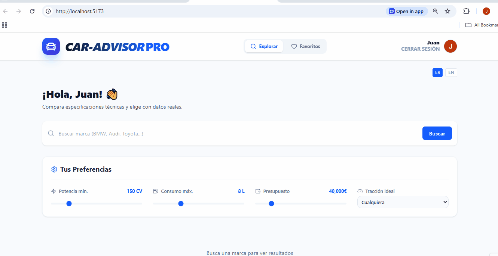

# 🏎️ Car Advisor Pro

**Live Project:** [caradvisorpro.es](https://caradvisorpro.es)

## 🌟 Project Overview

Car Advisor Pro is a professional vehicle search and comparison platform. I built this tool to centralize complex technical specifications into an intuitive interface, helping users make data-driven decisions during their car-buying process.

<p align="center">
  
</p>

## 💎 Technical Highlights (What I'm proud of)

- **Automated CI/CD Pipeline:** Fully automated deployments using **GitHub Actions**. Every push to `main` is automatically tested and deployed to **Firebase Hosting**, ensuring a seamless and error-free release cycle.
- **Data Normalization Logic:** Developed custom algorithms to merge and sanitize inconsistent data from multiple external sources (**API Ninjas** and **NHTSA vPIC**) into a unified, clean UI.
- **Type Safety & Scalability:** Built with a strict **TypeScript** architecture. Using custom interfaces and types, I've minimized runtime errors and ensured the codebase remains maintainable as features grow.
- **Optimized UX/UI:** Designed with a "Mobile First" approach using **Tailwind CSS**. It includes a performance-oriented architecture, AdSense-ready layouts, and a custom-built cookie consent system to comply with privacy regulations.

## 🛠️ Tech Stack

- **Frontend:** React 18, TypeScript, Tailwind CSS.
- **Backend:** Firebase (Auth, Firestore, Hosting).
- **DevOps:** GitHub Actions (CI/CD).
- **Tools:** Vite, Lucide Icons, Headless UI.

## 📦 Installation & Local Setup

1. **Clone & Install:**
   ```bash
   git clone [https://github.com/juanzafe/car-advisor-pro.git](https://github.com/juanzafe/car-advisor-pro.git)
   cd car-advisor-pro
   npm install
   Environment Variables: Create a .env file in the root directory and add your credentials:
   ```

Fragmento de código
VITE_FIREBASE_API_KEY=your_api_key
VITE_NINJA_API_KEY=your_ninja_key
Development Mode:

Bash
npm run dev

👨‍💻 Author
Juan Zamudio

GitHub: @juanzafe

LinkedIn: juanzamudio-a3a20375

Email: juanzamudiofdez@gmail.com

Developed by a Frontend Developer.
